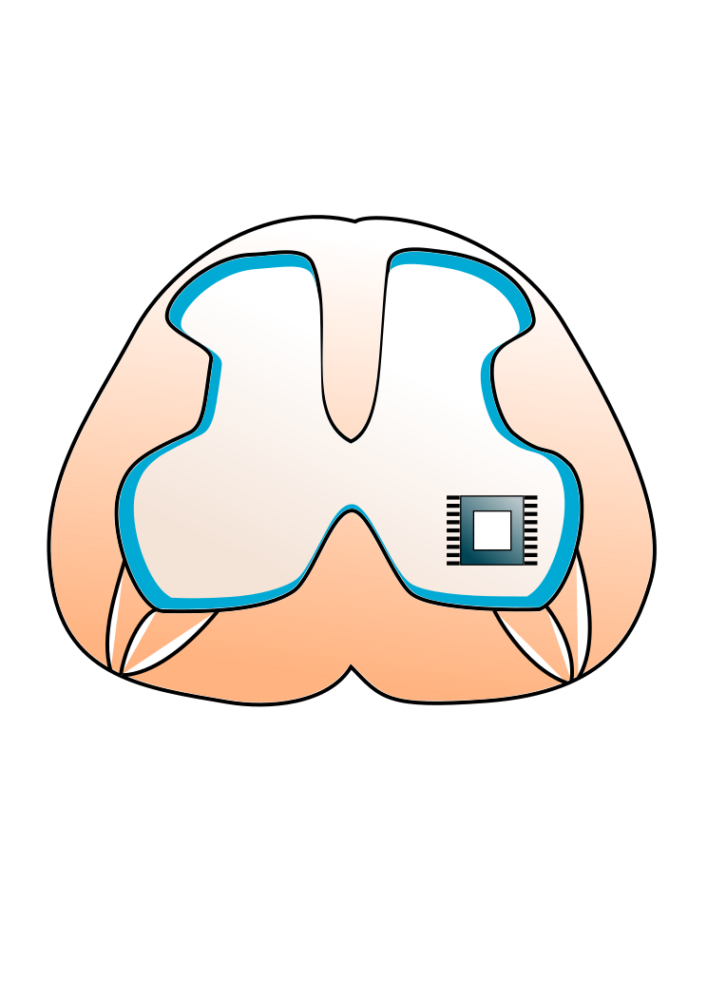
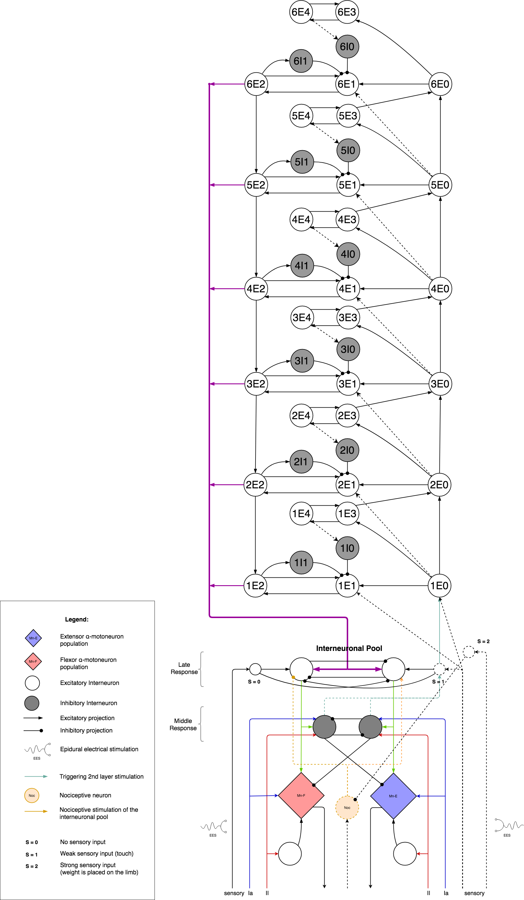
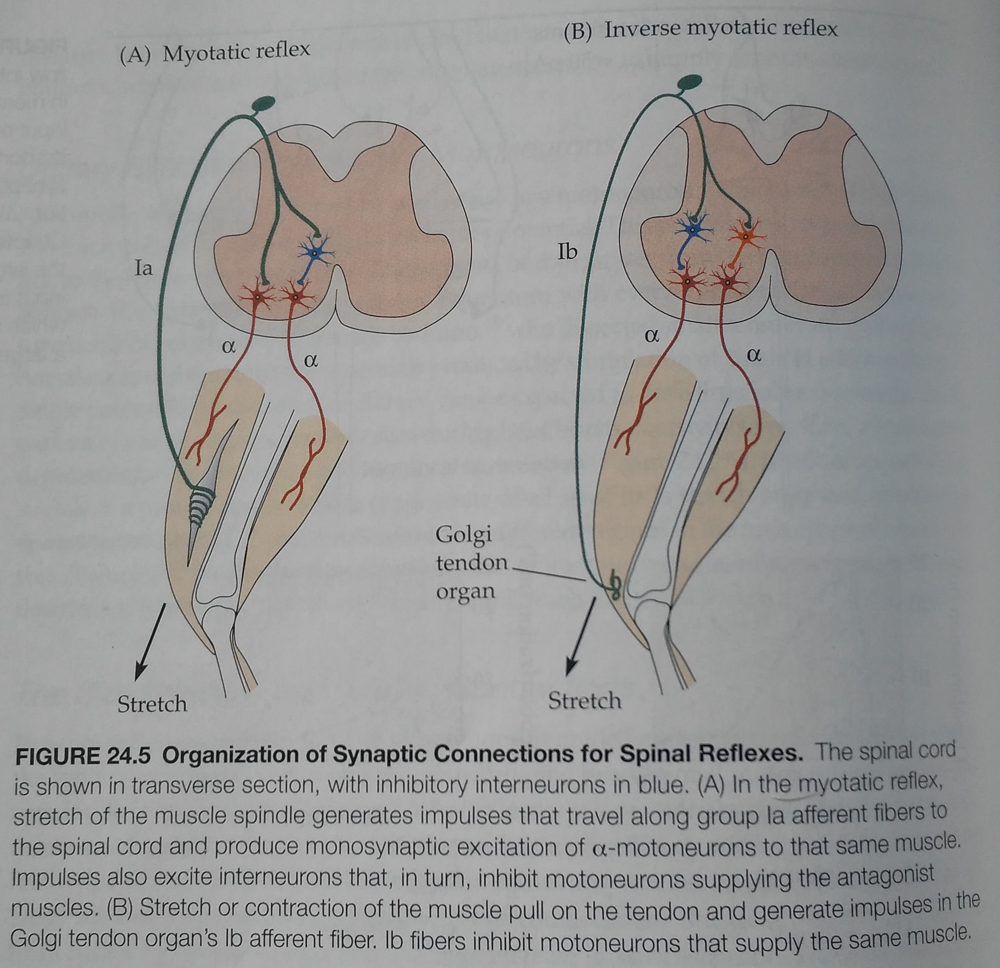

<!--  -->



### Intro
Model of ES (Electric stimulation) of spinal cord. It should enhance walking cycle with correct parameters. A proposed scheme is below.

<!--  -->


### Install

The project is compatible with python3 so when you start working on it you better have a *python3 virtualenv*. What is a virtualenv and how to work with it? Please read [here](http://www.simononsoftware.com/virtualenv-tutorial-part-2/). After you have got a *virtualenv* tool.
```
mkvirtualenv python3.5 -p /usr/bin/python3.5
```

After that you need to go the project's root and execute the below. Those are project's dependencies. For more information please read [this](https://caremad.io/posts/2013/07/setup-vs-requirement/).
```
pip install -r requirements.txt 
```

Also you need to have a custom NEST model [hh_moto_5ht](https://github.com/research-team/hh-moto-5ht) with your NEST installation.

#### Problem intro
During SCI(Spinal Cord Injury) a rat loses its ability to move hind limbs. It restores its ability to walk with ES(Epidural Stimulation) only after 5 weeks. This restoration of walking happens in sync with the appearance of LR(Late Response) in the EMG of muscles. MR(Middle Response) appears during the 2nd week. Injection of 5-HT enhances the same effect of walking restoration almost immediately when applied directly to the spinal cord. This allows us to derive that during first two weeks the monosynaptic circuit or the first level restores and it brings MR to the EMG. During five weeks the polysynaptic circuit restores and brings LR to the EMG.

#### Some biology details
Muscle is innervated by motoneurons (efferents), sensory neurons (afferents). They can be classified.

**MotoNeurons**
- Alpha motoneurons. Innervate muscles. Convey signals to contraction/stretch.
- Gamma motoneurons. Innervate muscle spindles. Convey signals to contraction/stretch.

**Sensory neurons**
- Group 1.
  - Group 1a. Innervates muscle spindles. Conveys input about contraction/stretch. Fast. It excites its agonist, inhibits antagonist.
  - Group 1b. Innervates junction between muscle and its tendon. Not presented on images. Conveys input about its own contraction/stretch. It inhibits its agonist.
- Group 2. Innervates muscle spindles. Conveys input about contraction/stretch. Slow. It excites its agonist, inhibits antagonist. When a muscle is relaxed, all of its afferents are zero. Lets contract the muscle. Information about its contraction/stretch is conveyed with 0.2s delay here comparing to Group 1a.

<!--  -->


<!--  -->


#### About computational model of Moraud and Marco 2016
They research the influence of Group 1a, Group 2 afferents only. Their simple model is presented at the figure 1A. Afferents are represented as Frequency Generators. They generate different activity for different environments. Those activities are predefined and were gotten by recording from real rat's afferents in those different environments. Model's validation:
- Serotonin-mediated modulation of motoneurons is conveyed by reducing the conductance of potassium-calcium gated ion channels. They report that the lack of 5HT modulation can be compensated by increasing ES frequency. Figure 8A.
- Variation of single ES intensity as on the Figure 1E.
- During locomotion. Increase of ES frequency led to linear increase in the mean firing rate of Ia and II afferents comparable to the increase of single ES. Temporal profiles of afferent firing rates were preserved. The linear increase in afferents led to a linear increase of motoneurons during their active phase. Increase of ES amplitude led to direct recruitment of motoneurons and disruption of alternation between flexor and extensor. See Figure 2A, 2B. **How did the increase of ES frequency lead to the increase of afferents frequency, if afferents were represented as Frequency generators?**
- During locomotion. Protocols of ES: 40 hz + 1.2 motor threshold amplitude, 80 hz + 1.2 motor threshold amplitude, 40 hz + 1.4 motor threshold amplitude, - must behave as Figure 2C.
- During locomotion. The duration of gait cycle must be sync with the step speed as on Figure 2D.
- Each phase of gait is independent of the other e.g. we can modulate ES each phase independently in order to balance step heights for example. The collateral of this is a full balance of steps. So, independent ES frequencies are much better.

General questions:
- Temporal profile in firing rate?
- Frequency harmonics?

#### Network parameters

##### Neurons
Numbers below are per muscle e.g. for example the flexor. For the antagonist muscle numbers are the same. Initial numbers were taken from [Moraud 2016](https://senselab.med.yale.edu/ModelDB/ShowModel.cshtml?model=189786).

**MotoNeurons**
- Number: 169
- Type: HH model with: sodium, potassium, calcium, and potassium-calcium. For the start we would use only: sodium, potassium. 

**1A fibers**
- Number: 60
- Type: [IntFire1](https://www.neuron.yale.edu/neuron/static/docs/help/neuron/neuron/mech.html#IntFire1) with `tau=0.5, refrac=1`
- Firing rate: `Ia firing rate = 50 + 2*stretch + 4.3*sign(strVelocity)*|strVelocity|^0.6 + 50*EMG`

**1B fibers**
- ?

**2 fibers**
- Number 60
- Type: - Type: [IntFire1](https://www.neuron.yale.edu/neuron/static/docs/help/neuron/neuron/mech.html#IntFire1) with `tau=0.5, refrac=1`
- Firing rate: `II firing rate = 80 + 13.5*stretch + 20*EMG`

**Cutaneous fibers**
- ?

**1A Inhibitory InterNeurons**
- Number: 196
- Neuron Type: [IntFire4](https://www.neuron.yale.edu/neuron/static/docs/help/neuron/neuron/mech.html#IntFire4) with `taue=0.5, taui1=5, taui2=10, taum=30`
- Nest Type: [iaf_psc_alpha](https://github.com/nest/nest-simulator/blob/master/models/iaf_psc_alpha.h) [*](#neuron-to-nest) with `tau_syn_ex=0.5, tau_syn_in=5, tau_m=30`  

**2 Excitatory InterNeurons**
- Number: 196
- Neuron Type: [IntFire4](https://www.neuron.yale.edu/neuron/static/docs/help/neuron/neuron/mech.html#IntFire4) with `taue=0.5, taui1=5, taui2=10, taum=30`  
- Nest Type: [iaf_psc_alpha](https://github.com/nest/nest-simulator/blob/master/models/iaf_psc_alpha.h) [*](#neuron-to-nest) with `tau_syn_ex=0.5, tau_syn_in=5, tau_m=30`  

##### Connections
 
**flexor 1A-fibers - flexor MotoNeurons**

Each motoneuron connected to all 1A fibers without any tricks and randomness.
- from *SynFlexFlex.hoc:53-66*, *M_Cell.hoc:105-125*
- nest connection type: all-to-all.
- Neuron type: [ExpSyn](https://www.neuron.yale.edu/neuron/static/docs/help/neuron/neuron/mech.html#ExpSyn) with `e=0, tau=0.5`.
- Nest type: none specific. Please see [below](#neuron-to-nest). 
- delay: 2 + Normal(0, 0.3 || 0.03) ms. In the paper 0.3 but in src 0.03. `Ia+taur.normal(0,0.03)`.
- weight: 0.052608, `hi_motor_S = 0.0411 + 0.0411 * 0.28`.

**flexor 1A-fibers - flexor 1A-Inhibitory InterNeurons**

Connect each interneuron 62 times with all fibers randomly picking the fiber each connection.
- from *SynFlexFlex.hoc:68-78*
- nest connection type: fixed-indegree 62 `FromAll_IAf_ToOne_IAint`. InterNeurons are 'in'. Uniform.
- delay: 2 + Normal(0, 0.03) ms. `Ia+taur.normal(0,0.03)`
- weight: 0.0175, `hi= 0.0175`

**flexor 2-Excitatory InterNeurons - flexor MotoNeurons**

- from *SynFlexFlex.hoc:81-92*, *M_Cell.hoc:128-140*
- nest connection type: fixed-indegree 116 `FromAll_EXIN_ToOne_MN`. MotoNeurons are 'in'. Uniform.
- Neuron type: [ExpSyn](https://www.neuron.yale.edu/neuron/static/docs/help/neuron/neuron/mech.html#ExpSyn) with `e=0, tau=0.5`.
- Nest type: none specific. Please see [below](#neuron-to-nest).   
- delay: 1ms, `tausyn=1`
- weight: 0.00907, `hi_motor_Ex= (hi_motor_S*FromAll_IAf_ToOne_MN/FromAll_EXIN_ToOne_MN)/3`

**flexor 2-Fibers - flexor 2-Excitatory InterNeurons**

- from *SynFlexFlex.hoc:95-106*
- nest connection type: fixed-indegree 62 `FromAll_IIf_ToOne_EXIN`. InterNeurons are 'in'. Uniform.
- delay: 3 + Normal(0, 0.03) ms, `II+taur.normal(0,0.03)`
- weight: 0.0175, `hi= 0.0175`

**flexor 2-Fibers - flexor 1A-Inhibitory InterNeurons**

- from *SynFlexFlex.hoc:108-119*
- nest connection type: fixed-indegree 62 `FromAll_IIf_ToOne_IAint`. InterNeurons are 'in'. Uniform.
- delay: 3 + Normal(0, 0.03) ms, `II+taur.normal(0,0.03)`
- weight: 0.0175, `hi= 0.0175`

**extensor 1A-Inhibitory InterNeurons - flexor 1A-Inhibitory InterNeurons**

- from *SynExtFlex.hoc:6-18*
- nest connection type: fixed-indegree 100 `FromAll_IAint_ToOne_IAint`. Flexor InterNeurons are 'in'. Uniform.
- delay: 1ms, `tausyn=1`
- weight: -0.007, `-(lo=0.007)`

**flexor 1A-Inhibitory InterNeurons - extensor 1A-Inhibitory InterNeurons**

- from *SynExtFlex.hoc:20-30*
- nest connection type: fixed-indegree 100 `FromAll_IAint_ToOne_IAint`. Extensor InterNeurons are 'in'. Uniform.
- delay: 1ms, `tausyn=1`. **Warning, in the sources this delay is missing**
- weight: -0.007, `-(lo=0.007)`

**extensor 1A-Inhibitory InterNeurons - flexor MotoNeurons**

Every motoneuron connected 232 times randomly to the pool of interneurons. There is a very small possibility that it will connect 232 times to the same interneuron.
- from *SynExtFlex.hoc:32-44*, *M_Cell.hoc:141-147*
- nest connection type: fixed-outdegree 232 `FromAll_IAint_ToOne_MN`. MotoNeurons are 'out'. Uniform.
- Neuron type: [Exp2Syn](https://www.neuron.yale.edu/neuron/static/docs/help/neuron/neuron/mech.html#Exp2Syn) with `e=-75, tau1=1.5, tau2=2`.
- Nest type: none specific. Please see [below](#neuron-to-nest).   
- delay: 1ms, `tausyn=1`
- weight: 0.0023, `lom=0.0023`

**flexor 1A-Inhibitory InterNeurons - extensor MotoNeurons**

- from *SynExtFlex.hoc:46-57*, *M_Cell.hoc:141-147*
- nest connection type: fixed-indegree 232 `FromAll_IAint_ToOne_MN`. MotoNeurons are 'in'. Uniform.
- type: [Exp2Syn](https://www.neuron.yale.edu/neuron/static/docs/help/neuron/neuron/mech.html#Exp2Syn) with `e=-75, tau1=1.5, tau2=2`.   
- Nest type: none specific. Please see [below](#neuron-to-nest).
- delay: 1ms, `tausyn=1`
- weight: 0.0023, `lom=0.0023`

### Neuron to Nest

Problems: 
 - Nest models do not have dual exponential as time constants. Only aplha functions.
 - Neuron neurons mostly are normalized. It means that `V_m` value range is `[0, 1]mV` instead of usual `[-70, 40]mV`.
 - Nest synapses implement inhibition by negative weights. Neuron synapses implement inhibition with Reversal Potential and their weights are positive. So it's a separate task to transform inhibitory positive weights from Neuron to negative weights of Nest.

**IntFire4** does not have a counterpart in Nest. We use Nest's `iaf_psc_alpha` which uses an alpha function instead of a dual exponential for inhibitory tau. That is why `taui2=10` isn't used.
**ExpSyn** does not have a counterpart in Nest. Example how can we achieve it for **excitation** only. Lets take an HH neuron with an `ExpSyn` on it `e=0, tau=0.8`. In Nest it would be:
```python
neurons = nest.Create("hh_psc_alpha")
nest.CopyModel("static_synapse","excitatory",{"weight":1.,  "delay":1.5})
nest.Connect(neurons, ispikes, syn_spec="excitatory")
```
According to this [article](https://www.ncbi.nlm.nih.gov/pmc/articles/PMC5517781/). 

**Exp2Syn** The same as above. Lets take an HH neuron with an `Exp2Syn` on it `e=-75.0, tau1=0.99, tau2=1.0`. In Nest it would be (for **excitation** only):
```python
neurons = nest.Create("hh_psc_alpha", {'tau_syn_in':1.})
nest.CopyModel("static_synapse","inhibitory",{"weight":200., "delay":3.0})
nest.Connect(neurons, ispikes, syn_spec="inhibitory")
```
