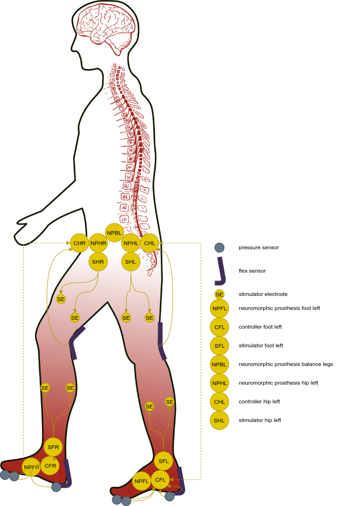
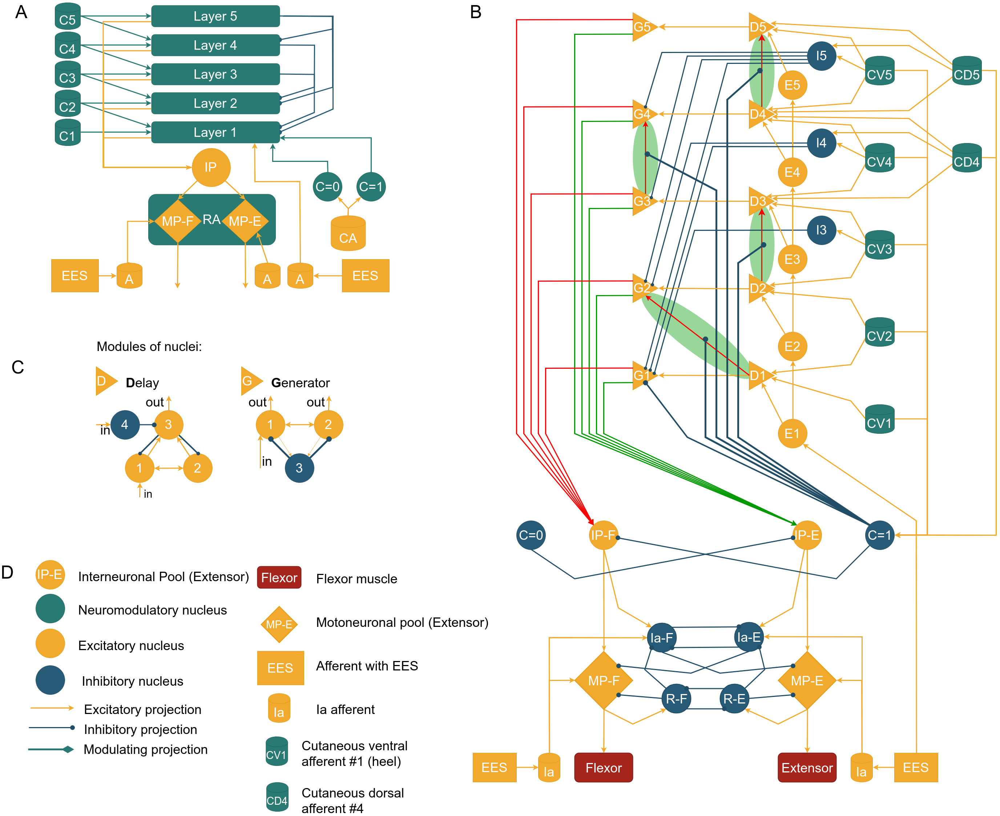
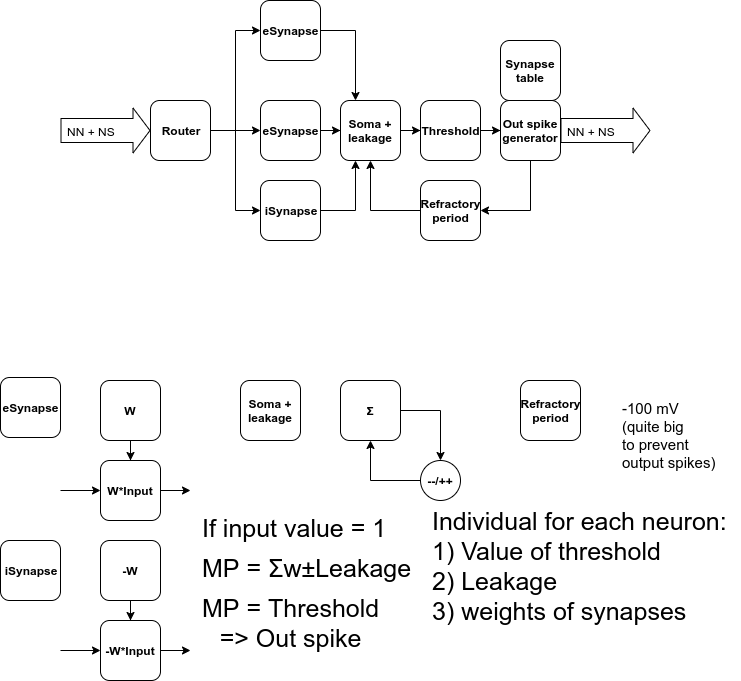
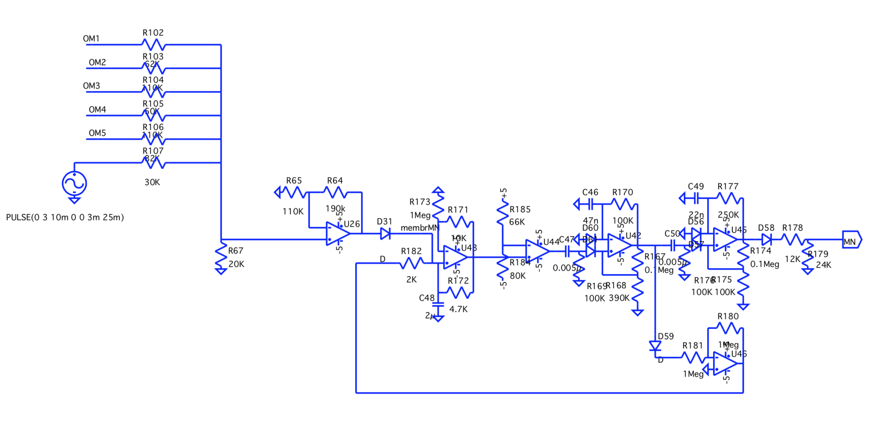
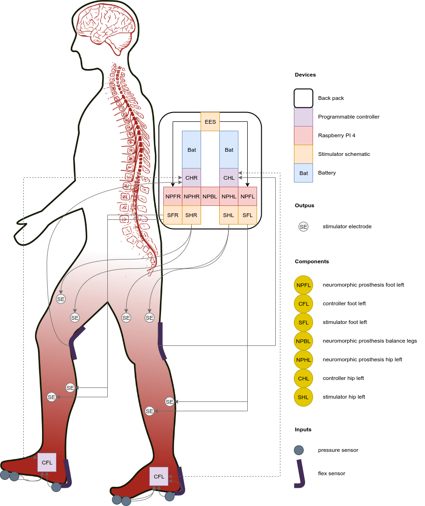
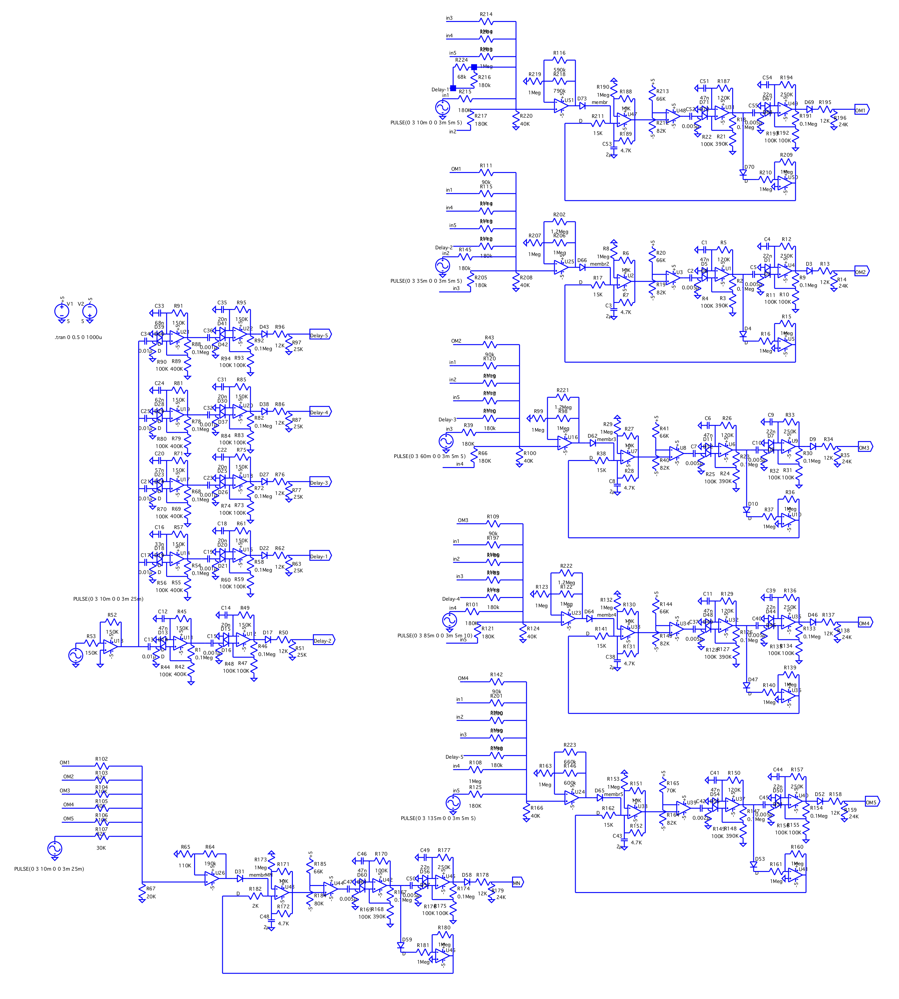
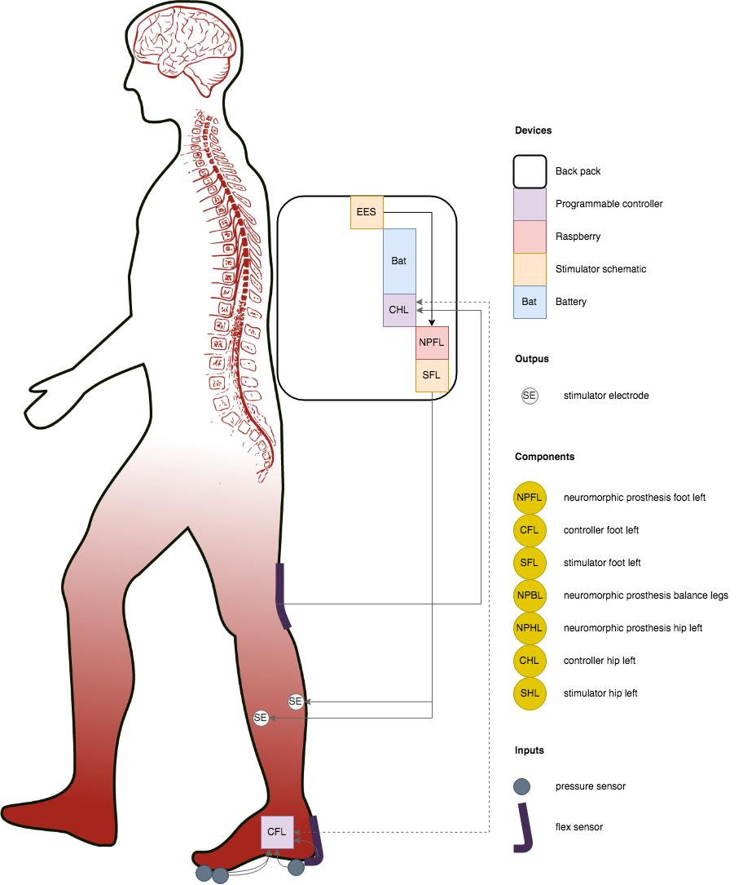

# Neuromorphic prosthesis Design specification 

## v 1.0

### Component diagram

#### HLD

#### MLD RA + CPG

#### MLD Left right legs balancing

#### LLD Simple Digital Neuron

#### LLD Simple Spiking Motoneuron

### Deployment diagram

## v 0.1 HLD

### Wiring diagram

#### LLD

### Deployment diagram

