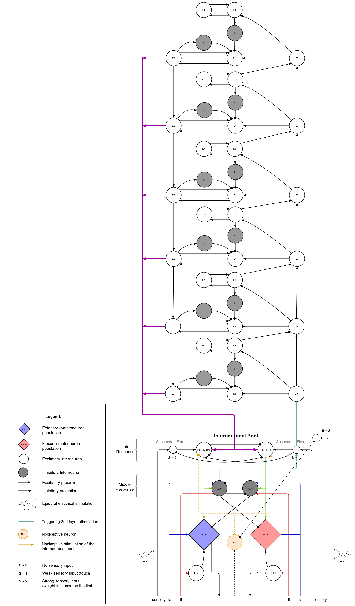

# Memristive spinal cord segment 

## Biological model

This is original biological model based on works of Igor Lavrov and it was proposed based on biological experiments (add references here), 

## Electronic model 

##1 muscle validation experiment 

1. Experimentator puts shoes with insole controller on 
1. Insole controller attached to 
