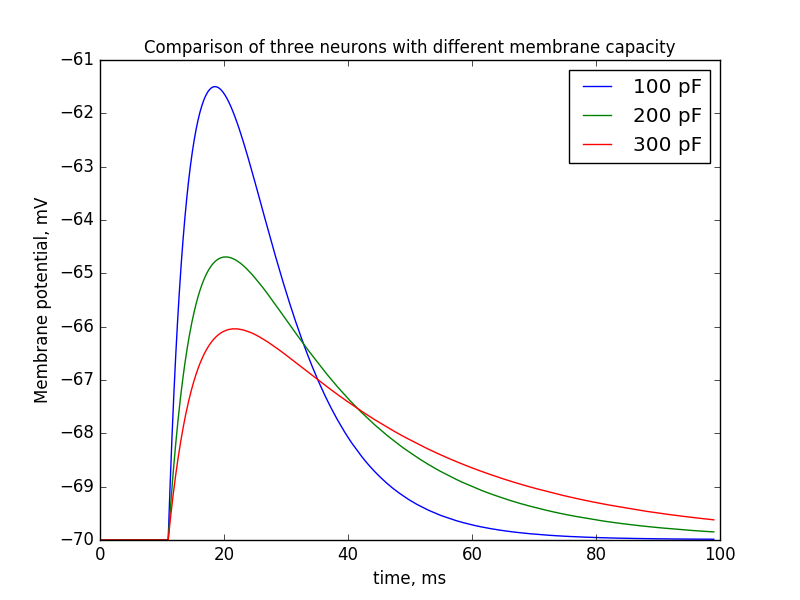

### Compare membrane potential behavior depending of membrane capacity

I suggest to simplify our scheme by using specific neurons in the right column of the scheme. The neurons have to be more inert than usual, i.e. they need membrane with higher capacity to accumulate charges effectively.  
I compared membrane potential reaction of three neurons with different membrane capacity on the same excitatory spike input projection.  
Results are pretty predictable I think.

#### Conclusions

The results confirm a suggestion to use high-capacity membrane for right neuron column of our scheme.
