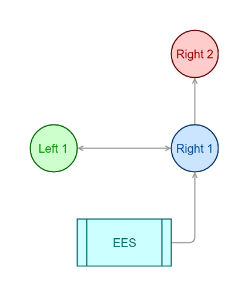
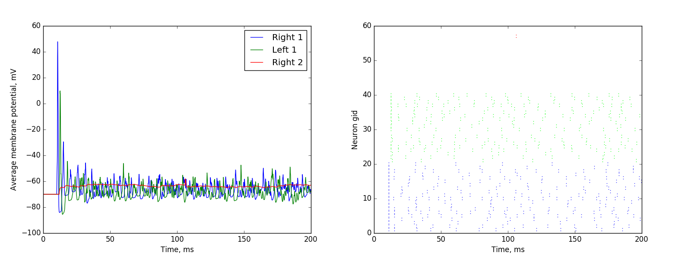
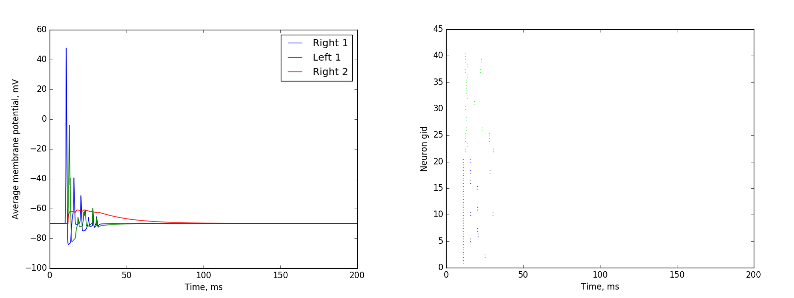
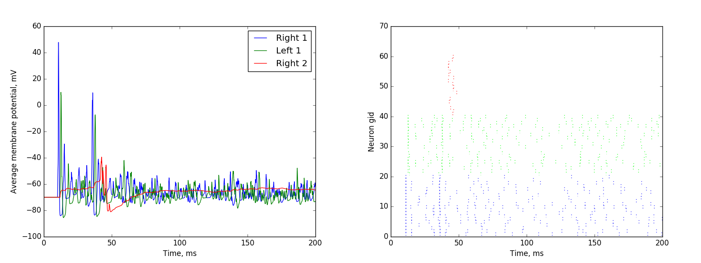
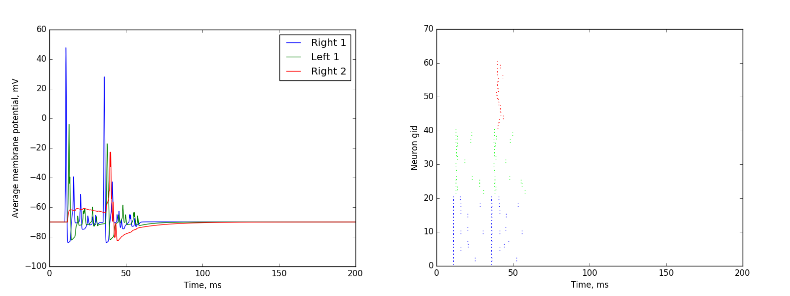

### Checking multi-level topology

We tried to check an opportunity of long-time charges accumulation by membrane and EES impulse transmission to the higher level of two-level topology.

#### Topology

We used the next simple topology to check both mechanisms:

#### Using membrane to accumulate charges

The neurons of the left one group have 100 pF membrane capacity, while the right group neurons have 200 pF membrane capacity.
We tried to activate with self-extinguishing and without it.

The red line is an average membrane potential of sublevel 2 neurons. As we can see 200 pF membrane keeps charges for pretty long time.

#### Several EES impulses

Now we tried to activate the sublevel 2 by the second pulse with 40 Hz frequency (i.e. after 25 ms relate to the previous one)

Of course, the third pulse can't provoke the next sublevel 2 activation in the reason of high Right 2 group membrane polarization

So the left group is essential for rapid depolarization of membrane.
