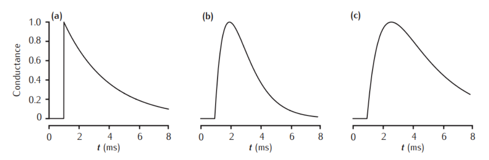
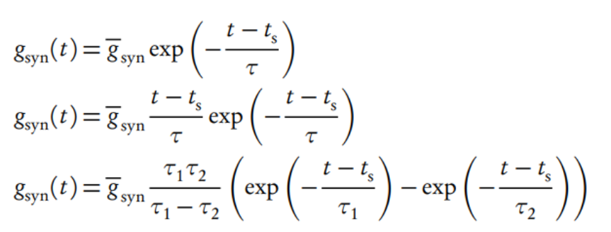
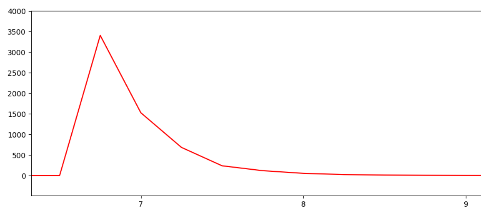
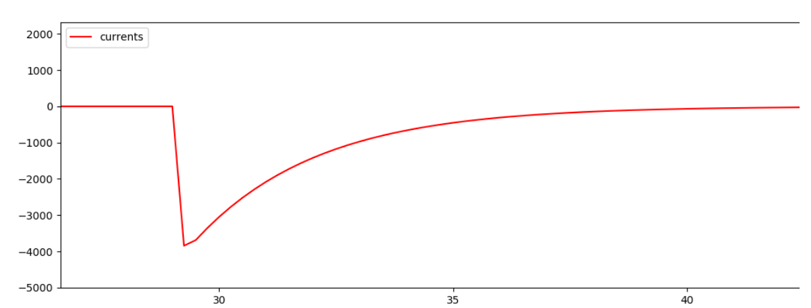
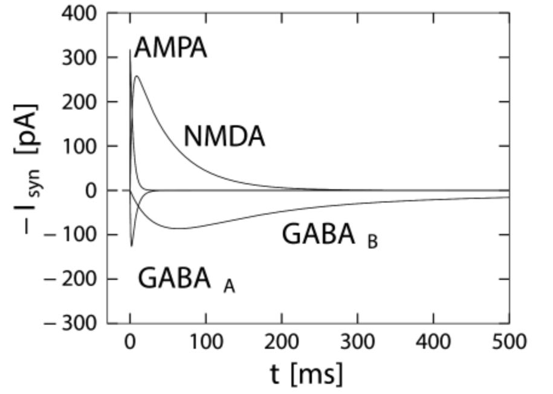

# Neural topology based on Izhikevich neuron model implemented on GPU (CUDA)

## Description:
Real time simulation of neural topology for [Memristive spinal cord project](https://github.com/research-team/memristive-spinal-cord)

## Installation
1. Install the CUDA

## Instruction "How to run the code"
You should have installed CUDA and Nvidia videocard

1. Clone the **[git project](https://github.com/research-team/memristive-spinal-cord)**
2. Open **IzhikevichGPU** folder
3. Compile by the command:
```bash
nvcc -o output cuda_sim.cu
```
4. Then run the program:
```bash
./output
```
5. Checking on errors and profiling by:
```bash
cuda-memcheck ./output
nvprof ./output
```
## Technical description (in progress):

### 1. Core

*Threads in a block* = 1024  
*Number of blocks* = 1

Because of high effiency of GPU calculation was decided to move the main simulation loop to the GPU kernel. 
The maximum size of threads in a block is 1024, but neuron number is aproximately 1520. What to do?  

Solution #1: use several blocks in the GPU grid (by the formula: *neurons number / threads per block + 1*). This solution is not applicable in our situaton because of strong step-by-step syncronization of sim iteration. A several blocks can't be calculated at the same. To solve this problem we can move the main simulation loop outside the GPU and put to the CPU. It is not a very effective solution: with *dt* step fewer than 0.25ms and simulation time more than 100ms an ellapsed time of simulation becomes higher than real time (!).

Solution #2: To solve the problem *one thread* = *one neuron* was used Grid-Stride Loop.  

```c++
for (int i = blockIdx.x * blockDim.x + threadIdx.x; i < neurons_number; i += blockDim.x * gridDim.x) {
  ... calculations ...
}
```
In this case one thread processing at least two neurons. It is not ideal but more effective than outside loop + easier to synchronize threads at each iteration.


### 2. Neuron (Izhikevich model)

### Synapse (without STDP but in future can be implemented)

#### Theory
>Three waveforms for synaptic conductance: (a) single exponential decay with τ = 3 ms, (b) alpha function with τ = 1 ms, and (c) dual exponential with τ1 = 3 ms and τ2 = 1 ms. Response to a single presynaptic action potential arriving at time = 1 ms. All conductances are scaled to a maximum of 1 (arbitrary units).
[David C., 2011][1]





#### My realization:
For economy of calculation I used simplified formula of decreasing I current by const value.


Excitatory current: step of decreasing 2 (*I_current = I_current / 2*)


Inhibitory current: step of decreasing 1.1 (*I_current = I_current / 1.1*)


#### Best solution (not efficient, but more biological)



## References

[1]: https://www.amazon.com/Principles-Computational-Modelling-Neuroscience-Sterratt/dp/0521877954

1. David C. Sterratt, Bruce P. Graham, Andrew J. Gillies, David J. Willshaw. Principles of Neuronal Modelling OR Principles of Computational Neuroscience OR Computational Modelling (2011). Cambridge University Press
