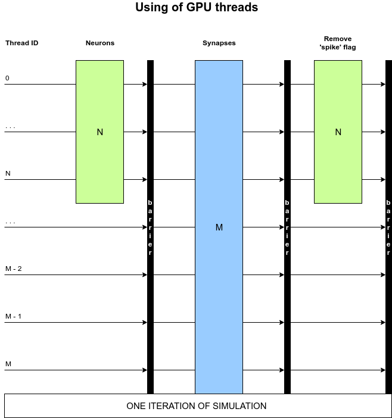

# Neural topology based on Izhikevich neuron model implemented on GPU (CUDA)

### Description:
Real time simulation of neural topology for [Memristive spinal cord project](https://github.com/research-team/memristive-spinal-cord)

### Installation
1. Install the CUDA

### Instruction "How to run the code"
You should have installed CUDA and Nvidia videocard

1. Clone the **[git project](https://github.com/research-team/memristive-spinal-cord)**
2. Open **IzhikevichGPU** folder
3. Compile by the command:
```bash
nvcc -lineinfo -o output cuda_sim.cu
```
4. Then run the program:
```bash
./output
```
5. Profiling by:
```bash
nvprof ./output
```
### Technical description (in progress):
Number of threads = number of synapses

Because of thread limitation in 1D grid (1024) in this implementations uses 2D grid (1024x1024).
2D array of threads (~10^6) is enough to use threadID as index for array of synapses.
Thus one block (2D grid) of threads process each synapse per iteration of simulation.


