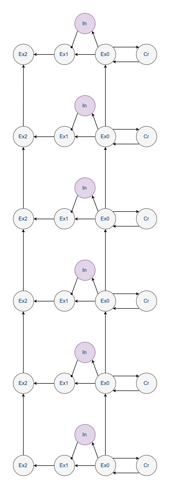
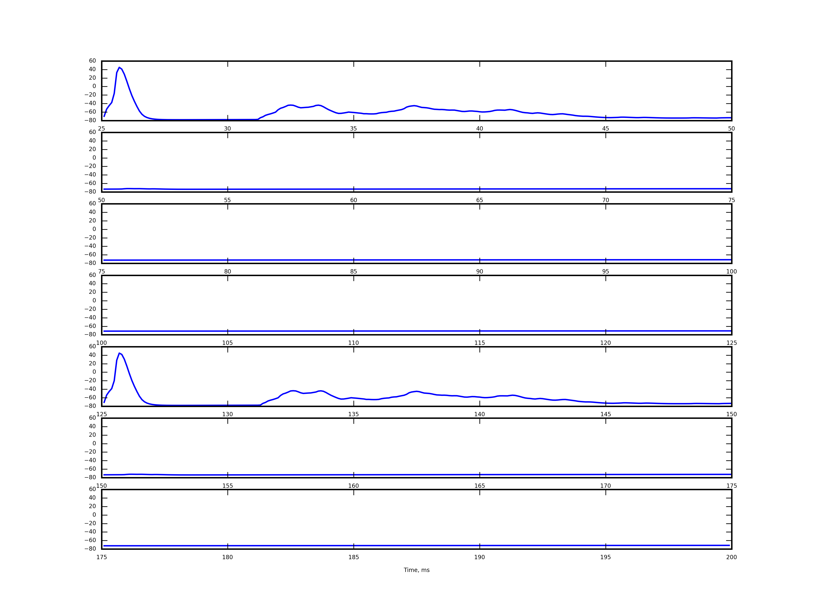

# Reformated basic scheme with hidden sublayers and middle gate-like neural group

## Topology

The main idea specific for this topology is inter-sublevels summation during top-oriented activity propagation, not bottom-oriented, as in earlier schemes

## 7 pulses with 40Hz frequency

40 Hz stimulation produces correct increasing delay between pc-responses

## Relaxation during low rate stimulation (10Hz)

In case of low rate stimulation we observed relaxing of the scheme to basic state, so only the first level was activated after both stimuli. 

