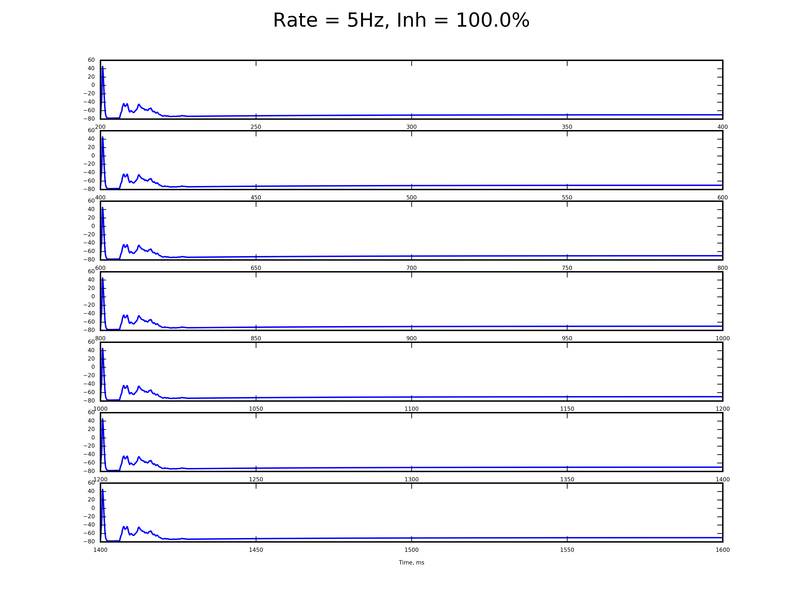
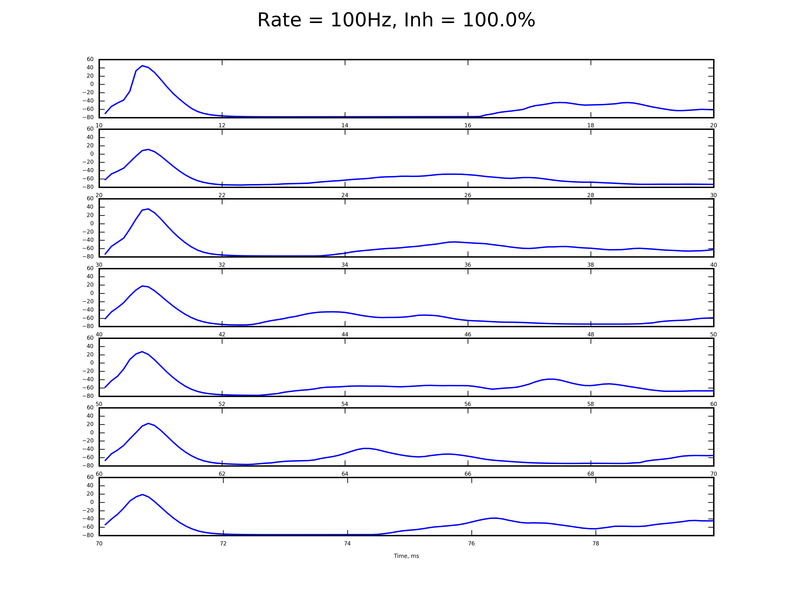
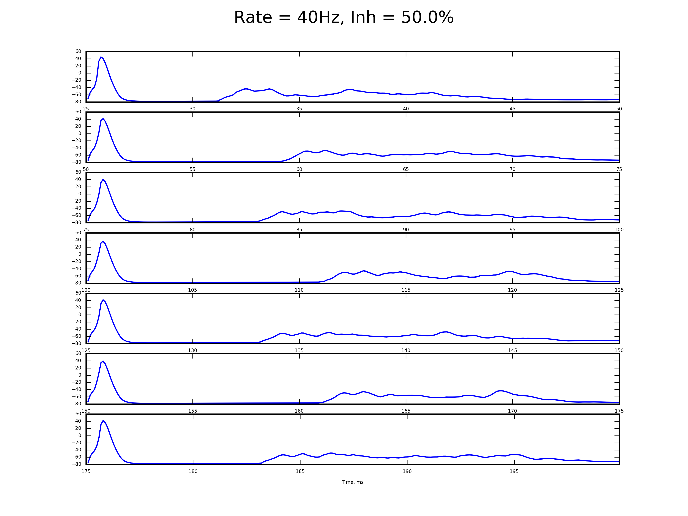
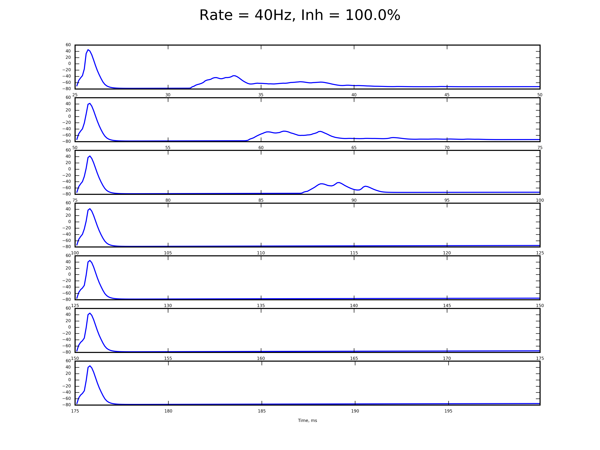
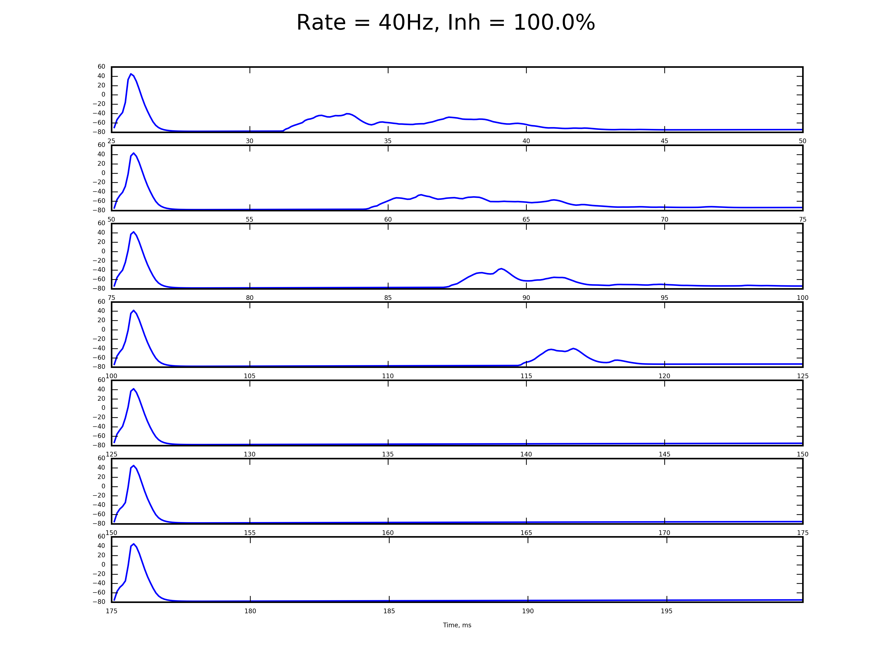
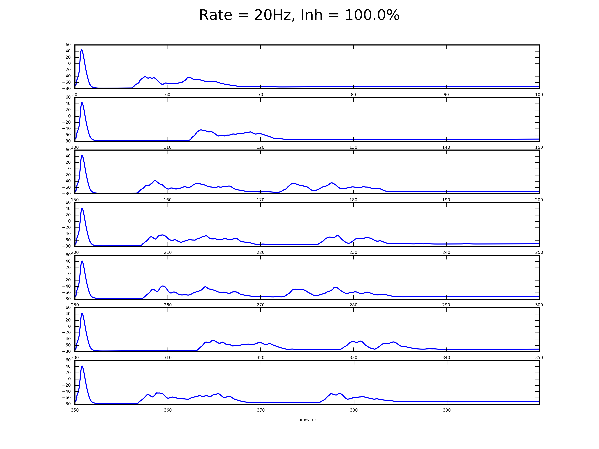
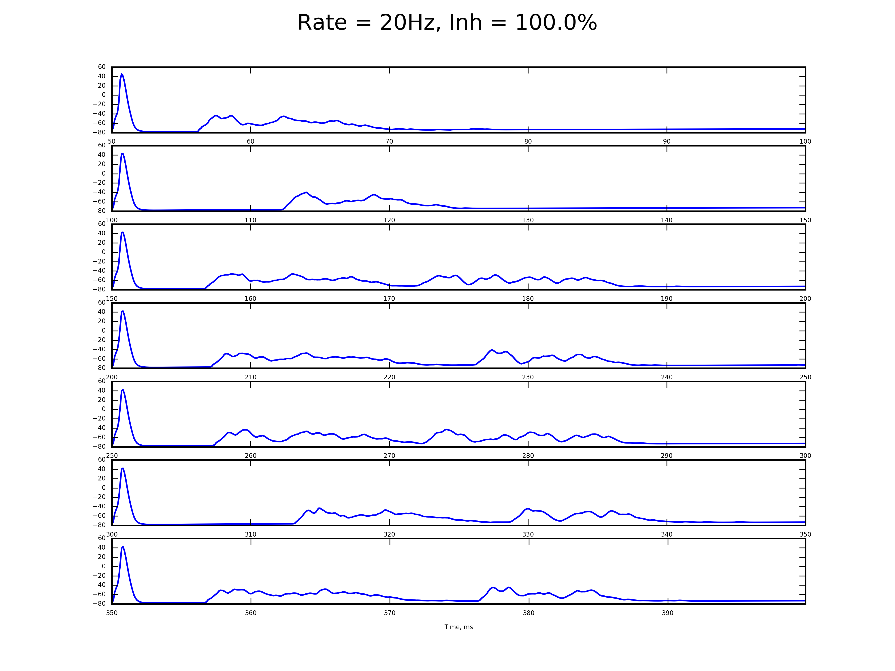

# Simulation with different params

## Switching rates

### Rate = 5Hz

### Rate = 10Hz

### Rate = 20Hz

### Rate = 30Hz

### Rate = 40Hz

### Rate = 60Hz

### Rate = 80Hz

### Rate = 100Hz

### Rate = 120Hz

## Switching inhibitory strength

### 100%

### 50%

### 0%

## Switching levels number

### 40 Hz

#### 1 sublevels

#### 2 sublevels

#### 3 sublevels

#### 4 sublevels

#### 5 sublevels

#### 6 sublevels

### 20 Hz

#### 1 sublevels

#### 2 sublevels

#### 3 sublevels

#### 4 sublevels

#### 5 sublevels

#### 6 sublevels

