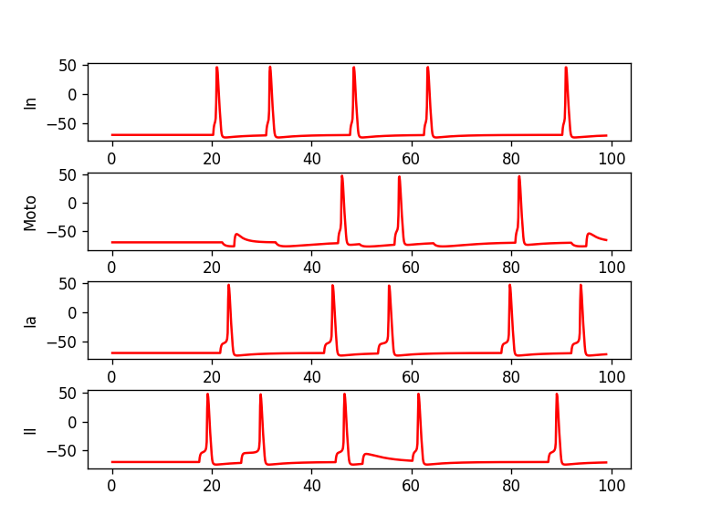
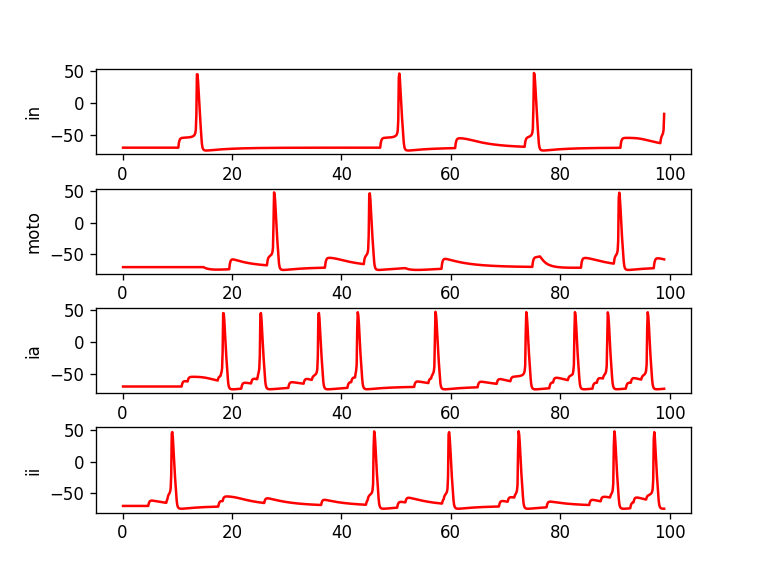

## Model

Model of the reflex arc

Figure 1. 
Motoneuron "moto", inhibitory interneuron "in", fibers "ia" and "ii'. 
Fibers "ia" and "ii" connect to two generators.
Fiber "ia" excites glutamine motoneuron.
And fiber "ii" excites glutamine interneuron,
that has inhibits GABA motoneuron. 

 

Figure 2. 
Generator rate 40 Hz.
Fiber "II" excites interneuron "In" and it inhibits motoneuron "Moto". 
Hyperpolarization arises.
In this time fiber "Ia" excites "Moto" and impulse arises, but doesn't reach threshold.
At 33 ms "In" inhibits "Moto" and arises hyperpolarization.
After 10 ms impulse from "Ia" induce spike in "Moto".
Then fiber "Ia" once more excites "Moto" and again spike arises.
Next 20 ms spikes don't arise.
Only hyperpolarization, due to inhibition by "In".
At 80 ms spike arises due to impulse from "Ia".
Then "In" inhibits "Moto" and arises hyperpolarization.
After 1 ms "Ia" excites "Moto" and impulse arises, but doesn't reach threshold.
Time of simulation finished.

Figure 3. 
Generator rate 300 Hz.
Fiber "II" excites interneuron "In" and it inhibits motoneuron "Moto". 
Hyperpolarization arises.
In this time fiber "Ia" excites "Moto".
Impulse arises, but doesn't reach threshold.
Next impulse from "Ia" induce spike in "Moto".
Then fiber "Ia" once more excites "Moto".
Impulse arises and again doesn't reach threshold.
But with the following excitation from "Ia", spike arises.
Next 40 ms in "Moto" spikes don't arise.
Only impulses, which does't reach threshold, because of inhibition by "In".
At 90 ms in "Moto" spike arises due to impulse from "Ia".
Time of simulation finished.
