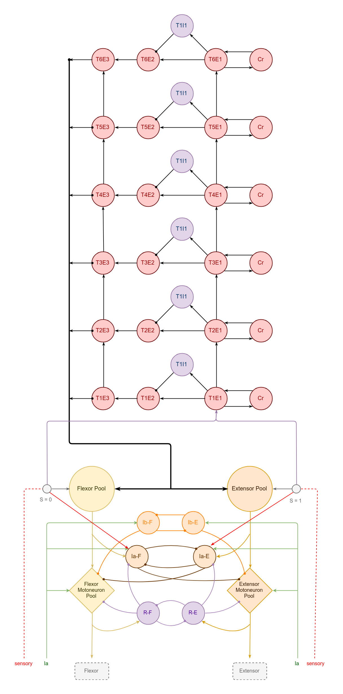
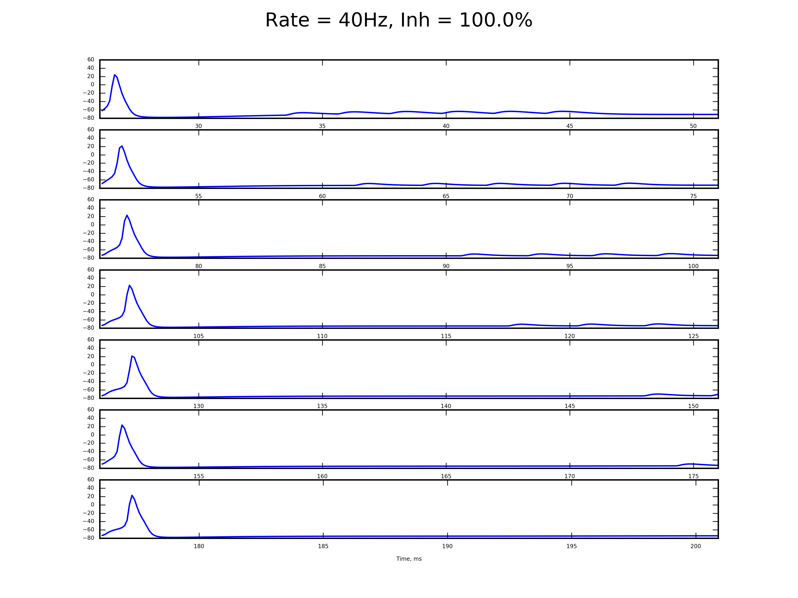

# OWS scheme with inhibition

## Topology

Topology was updated with two addtional projections from sensory interneurons to Ia interneurons to provide additional ihibitionary options

### Motoneuron

The topology keeps delay pattern between sublevels activation on extensor motoneuron

Flexor motoneurons partially inhibited

### Pool

Pool groups work without inhibition by each other

### Sensory interneurons

S = 1 is active by the reason of step-cycling, so it activates extensor ia and inhibits flexor pool group

