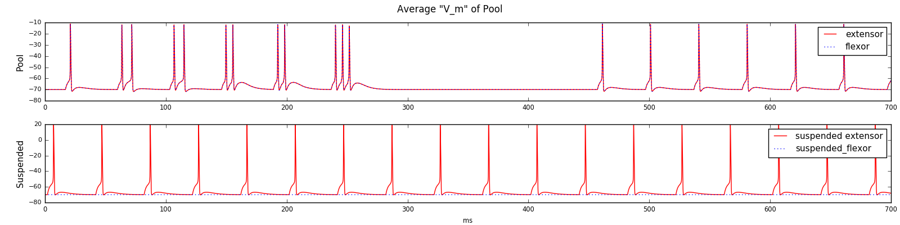
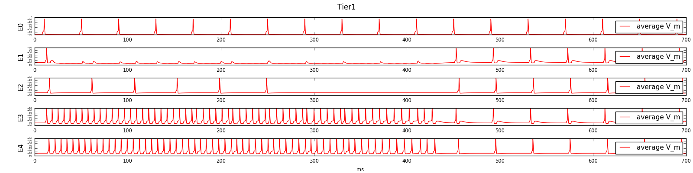

### Работа второго уровня с 6 подуровнями

#### Нарезка графика активности мотонейронов по 40мс
Видим возрастающие задержки, но вместе с тем активность самого первого подуровня доходит до мотонейрона очень поздно.  
Общая цепочка синапсов от афферентов до мотонейрона для первых 40 мс выглядит так:  
1. Ia, II afferents > Ex. Motoneurons  
2. Sensory afferents > S = 1 > Tier1-E0 > Tier1-E1 > Tier1-E2 > Pool-Extens > Ex. Motoneurons  -- 6 синапсов (1 - 1.23 ms)  

Можно попробовать увеличить веса синапсов внутри второго уровня для уменьшения времени достижения порогового значения потенциала мембраны  

  

#### График активности мотонейронов без нарезки  

Этот график можно поделить на три части:
1. 0-250 мс -- постепенное увеличение полисинаптических задержек  
2. 250-450 мс -- интервал, на котором активны все скрытые уровни, поэтому все подуровни второго уровня ингибированы  
3. 450-700 мс -- интервал, на котором самозатухает первый скрытый подуровень. Т.к. повторная активация этого подуровня сейчас невозможна, первый подуровень не ингибируется и отвечает всегда, а активность не поднимается на вышележащие уровни.  

#### Активность на пуле  

  
Видна суммация между уровнями и ответы только первого уровня в третьей фазе

#### График активность первого подуровня  

Здесь:  
E0 -- правая группа, на которую приходит сигнал;  
Е1 -- вставочная группа, за счёт ингбирования которой ингибируется весь уровень (по сути таким образом "ингибируется синапс" между E0 и Е2);   
Е2 -- левая группа, которая проецирует спайки на пул;  
E3, E4 -- группы, образующие скрытый уровень.  

 

#### Вывод

Основная проблема в слишком большом времени начала отклика каждого из подуровней, при этом задержки между уровнями выглядят корректными.