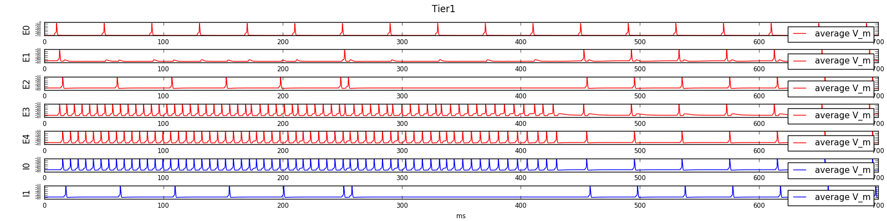
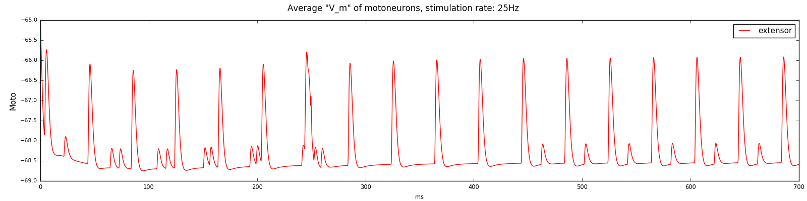
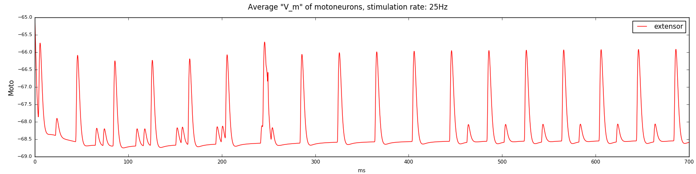

### Сравнение работы второго уровня с ингибирующими группами и с прямыми ингбирующими проекциями вместо них  

#### Работа первого подуровня

Для подуровней уменьшение времени ингибирвания группы E1 приводит к уменьшению количества спайков на первом подуровне  

С ингибирующими группами:
  

Без ингибирующих групп:

#### Сравнение активности мотонейронов

Заметно отсутствие одного спайка в конце цикла активности, но на время отклика первого уровня это не влияет

С ингибирующими группами:  

  

Без ингибирующих групп:  

