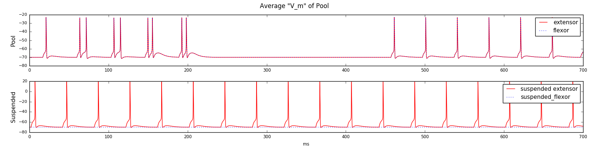
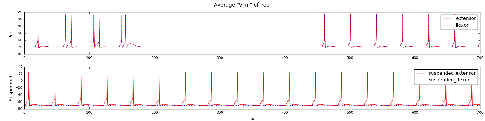
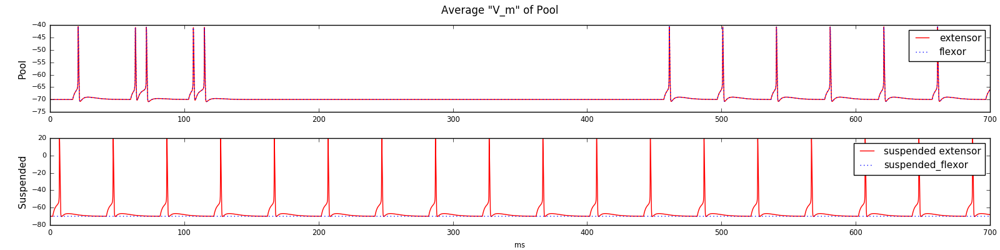
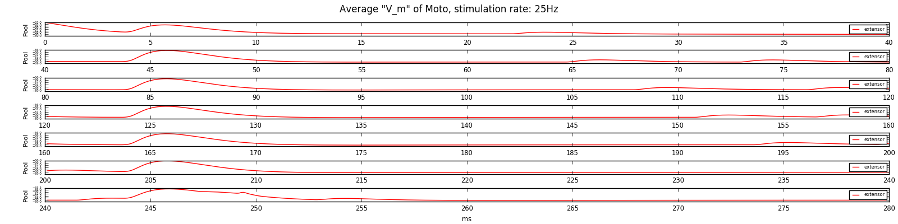
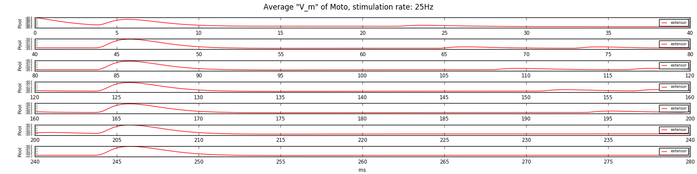
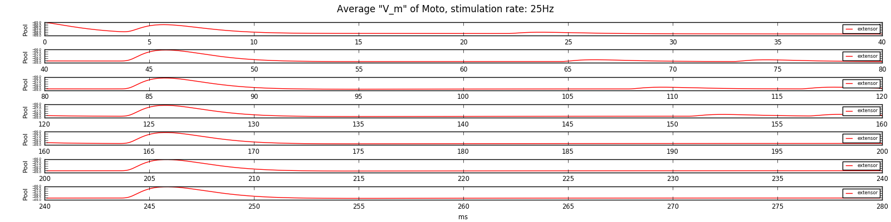
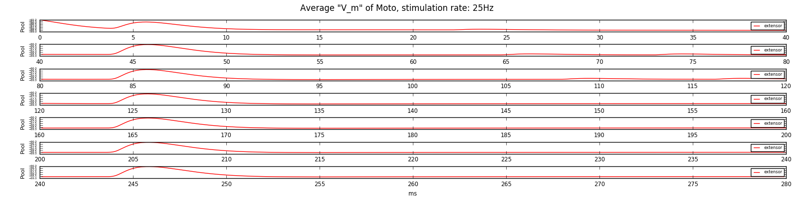
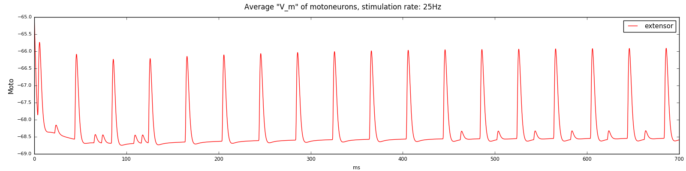

### Simulation with different number of the sublevels

#### Interneuronal pool

6 sublevels:  

5 sublevels:  

4 sublevels:  

3 sublevels:  

#### Motoneurons slices by 40 ms

6 sublevels:  

5 sublevels:  

4 sublevels:  

3 sublevels:  

#### Motoneurons whole 700 ms activity

6 sublevels:  

5 sublevels:

4 sublevels:  

3 sublevels:  

