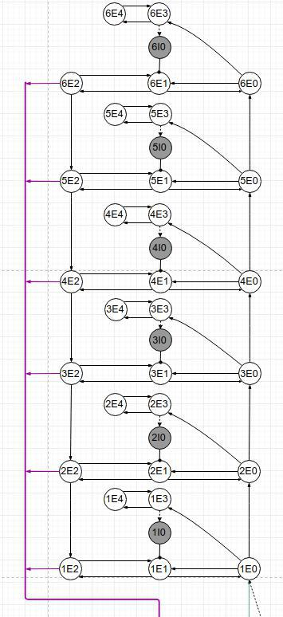
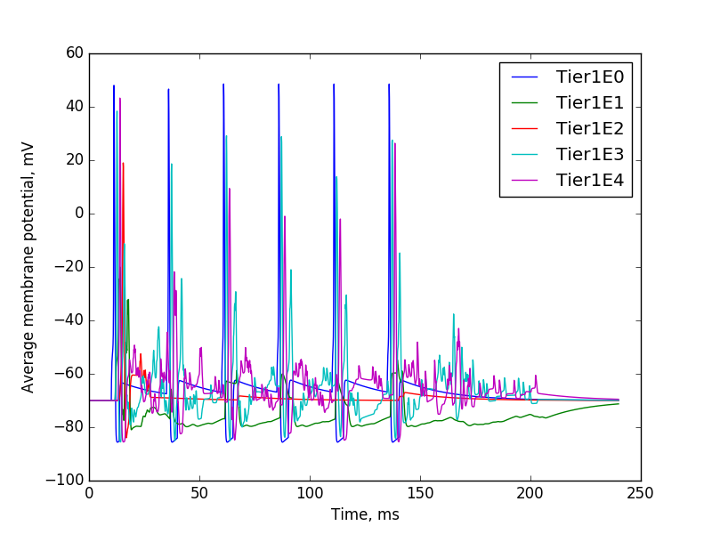
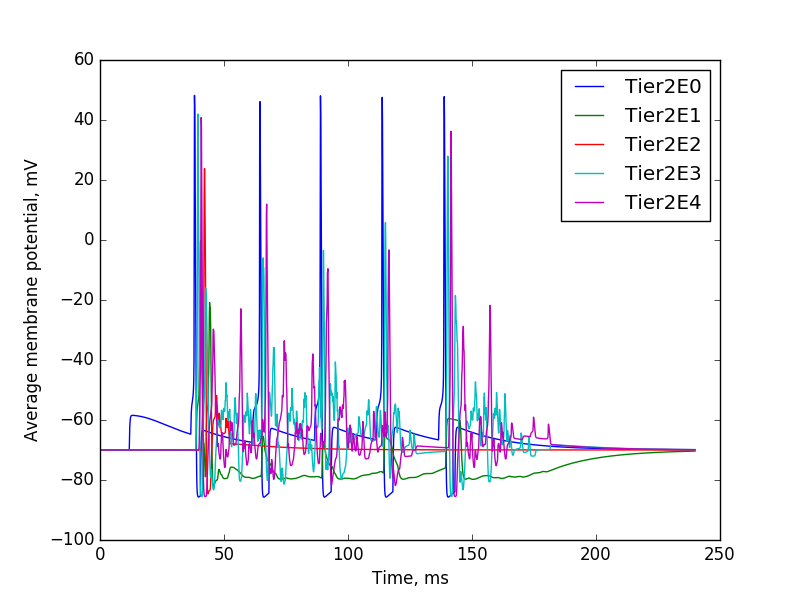
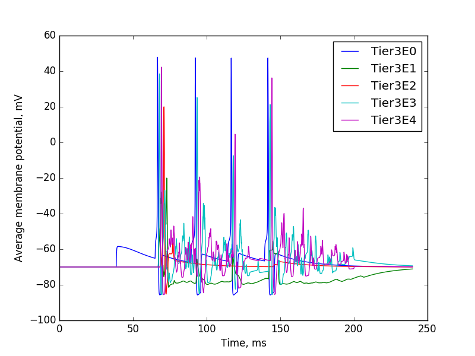

# Six layers activity propagation

### Topology

### Tiers activity

The follow figures demonstrate an ascent of the activity caused by the next EES pulse

There was 6 EES pulses

On the first sublayer we can see all of them

But on the second all pulses without the first one

Each sublevel except the first one activated after the seconnd input pulse

